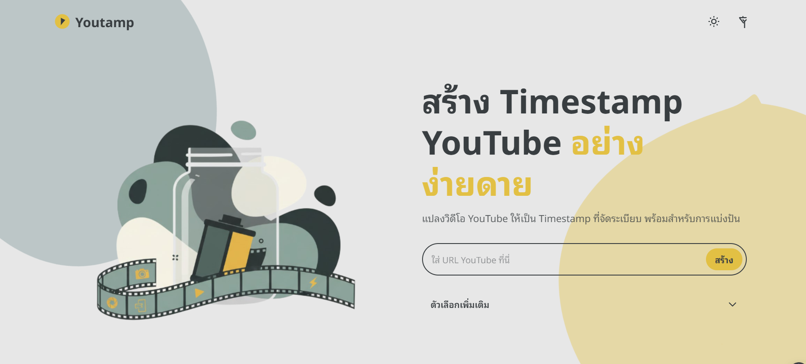
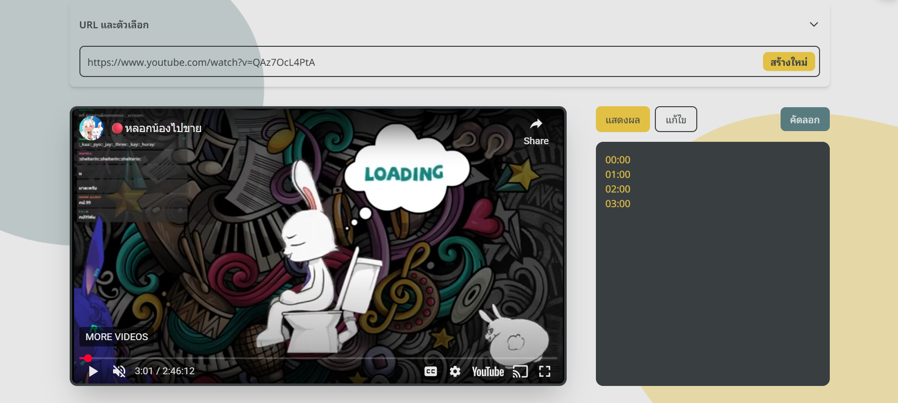

# Youtamp

<div align="center">





<h3>A simple web application for YouTube timestamp creation.</h3>

</div>

## Development

Follow these steps to set up and run the project in your local development environment.

### Prerequisites

*   [Python](https://www.python.org/downloads/) (version 3.12 or higher recommended)
*   [uv](https://docs.astral.sh/uv/getting-started/installation/#standalone-installer) (a fast Python package installer and resolver)

### Installation
**Clone the repository:**

```bash
git clone https://github.com/Onyx-Nostalgia/youtamp.git
cd youtamp
```

### Running the Development Server
1.  **Start the Flask development server:**
    ```bash
    uv run --env-file .env app.py
    ```
2. **Open the browser:** http://127.0.0.1:5000/ 

### Linting & Formatting

We use [Ruff](https://docs.astral.sh/ruff/) to maintain code quality and a consistent style.

**Check for issues:**
The following commands will report any issues without modifying files.
```bash
# Check for formatting issues
uvx ruff format --check .

# Check for linting errors
uvx ruff check .

# Check for type errors
uvx --with pydantic --with flask mypy .
```

**Apply fixes:**
The following commands will automatically format the code and fix any fixable linting issues (like removing unused imports).
```bash
# Automatically format all files
uvx ruff format .

# Automatically fix linting issues
uvx ruff check . --extend-fixable F401 --fix
```

> [!NOTE] 
> While Ruff can fix many issues automatically, some may require manual changes.